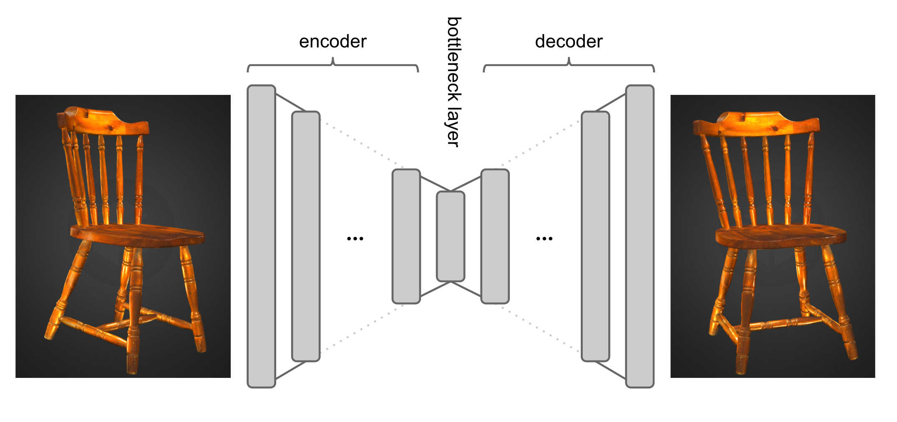
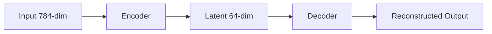
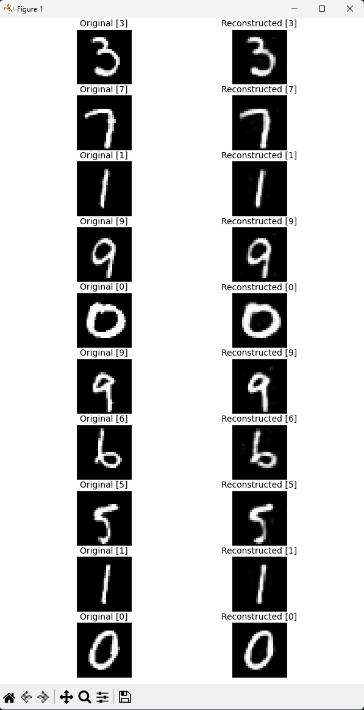

# **Scratch AutoEncoder: Fully-Connected MNIST AutoEncoder (From Scratch Implementation)**



[](https://www.python.org/)
[](https://pytorch.org/)
[](LICENSE)


A research-grade, from-scratch implementation of a **fully-connected AutoEncoder** trained on the **MNIST** dataset — including a **custom LinearLayer**, **custom IDX dataloader**, **training pipeline**, and **reconstruction visualization module**.
No `torchvision`, no shortcuts — everything is manually implemented for full transparency.

---

## **Table of Contents**

* [Overview](#overview)
* [Repository Structure](#repository-structure)
* [Model Architecture](#model-architecture)
* [Installation](#installation)
* [How to Run](#how-to-run)

  * [Train](#1-train-the-autoencoder)
  * [Visualize](#2-visualize-reconstructions)
* [Expected Outputs](#expected-outputs)
* [Configuration](#configuration)
* [References](#references)
* [License](#license)

---

# **Overview**

This project implements an AutoEncoder **completely from scratch** — including:

* Custom `LinearLayer` with Xavier initialization
* Two-layer **Encoder** and **Decoder**
* Raw MNIST IDX parser (without torchvision)
* Clean, research-style training loop
* Reconstruction visualization using Matplotlib
* Academic citation-style references

---

# **Repository Structure**

```
autoencoder/
├── LICENSE
├── README.md
├── autoencoder_weights.pth
├── data/
├── docs/
├── notebooks
│   ├── autoencoder.ipynb
│   └── mnist_reader.ipynb
├── requirements.txt
├── .gitignore
└── src
    ├── __init__.py
    ├── config.py
    ├── data_loader.py
    ├── layers.py
    ├── model.py
    ├── train.py
    └── visualize.py
```

---

# **Model Architecture**

### Custom Linear Layer

Implements weight + bias with explicit **Xavier uniform initialization**.

```python id="3uckxx"
LinearLayer(in_features → out_features)
```

### Encoder

`784 → 64 → 64` with Sigmoid activations.

### Decoder

`64 → 64 → 784` with Sigmoid output.

### AutoEncoder Pipeline



---

# **Installation**

```bash id="u8aaj0"
git clone https://github.com/Himanshu7921/scratch-autoencoder
cd autoencoder
pip install -r requirements.txt
```

Place MNIST IDX files inside `./data/`.

---

# **How to Run**

All commands are run from the project root:
```
autoencoder/
```

---

## **1. Train the AutoEncoder**

```bash id="xw4neg"
python -m src.train
```

This will:

* Load MNIST
* Normalize and flatten each image
* Train the AutoEncoder for **120 epochs**
* Save model weights as:

```
autoencoder_weights.pth
```

---

## **2. Visualize Reconstructions**

```bash id="bjp07g"
python -m src.visualize
```

This generates a grid showing:

* Original MNIST digits
* Reconstructed outputs

Saved as:

```
mnist_reconstructions.png
```

---

# **Expected Outputs**

### **Training Logs**

```
Epoch 0, Loss: xx
Epoch 5, Loss: xx
...
Epoch 115, Loss: xx
```

### **Reconstruction Sample**



---

# **Configuration**

All configs are in `src/config.py`:

| Parameter    | Value    |
| ------------ | -------- |
| `input_dim`  | `28*28`  |
| `hidden_dim` | `64`     |
| `latent_dim` | `64`     |
| `batch_size` | `64`     |
| `lr`         | `0.001`  |
| `epochs`     | `120`    |
| `input_path` | `./data` |

---

# **References**

### Official AutoEncoder Theory

* **Michelucci, U.** *An Introduction to Autoencoders*. arXiv:2201.03898
* **Bank, D., Koenigstein, N., Giryes, R.** *Autoencoders*. arXiv:2003.05991

### Research Paper–Style Citations

1. Arjovsky, M., Chintala, S., Bottou, L. *Wasserstein GANs*. ICML 2017.
2. Baldi, P. *Autoencoders and Deep Architectures*. ICML Workshop 2012.
3. Baldi, P., Hornik, K. *Neural Networks and PCA*. Neural Networks, 1989.
4. Bank, D., Giryes, R. *ETF View of Dropout*. BMVC 2020.

---

# **Citation**

If this project contributes to academic work:

```bibtex
@software{Singh_AutoEncoder_2026,
  author = {Himanshu Singh},
  title  = {Fully-Connected AutoEncoder for MNIST: A Research Implementation},
  year   = {2026},
  url    = {https://github.com/Himanshu7921/scratch-autoencoder}
}
```

---

# **License**

This project is licensed under the **MIT License**.
You are free to use, modify, and distribute this code with attribution.